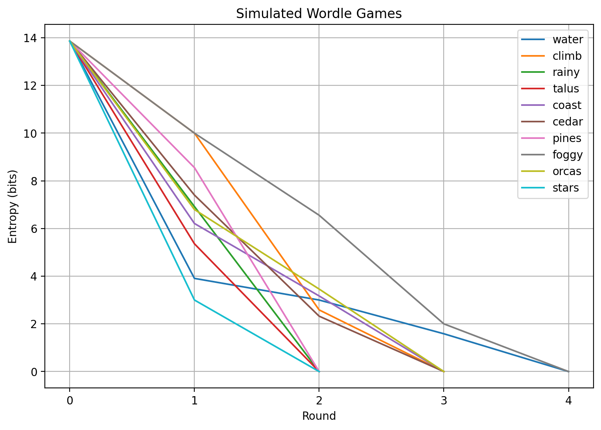
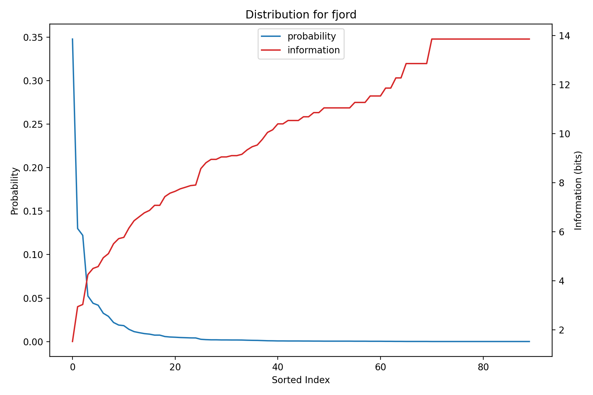

# Wordle

Play [Wordle](https://en.wikipedia.org/wiki/Wordle) with an engine that combines information theory and word frequency data to make optimal guesses and assist the user in solving puzzles. There are 3 primary modes of interaction for users:

1. A self-contained "offline" mode with a provided or random solution. The user is prompted for guesses and is shown the resulting square pattern. Optional engine assistance is available.
2. An assistant "online" mode that helps the user solve an external puzzle with an unknown solution. The user is prompted for both guesses and the square pattern returned by the puzzle.
3. An exploratory simulations mode where the user can play around with the engine, solving simulated puzzles in a Jupyter notebook, as well as examine the data more closely.

## Usage

### Offline

```text
Usage: offline.py [OPTIONS]

  Play Wordle with a provided or random solution.

Options:
  -a, --assist           Display frequency and entropy assistance to player.
  -s, --solution TEXT    Provide a solution for the game. Random if not set.
  -l, --infolen INTEGER  If assisting, max # of suggestions to log per round.
  --help                 Show this message and exit.
```

### Online

```text
Usage: online.py [OPTIONS]

  Play Wordle with an unknown solution.

Options:
  -t, --targeted         Use known targets sub-list to prime engine.
  -l, --infolen INTEGER  Max # of suggestions to log per round.
  --help                 Show this message and exit.
```

## Engine Assistance

The engine helps the user by providing 2 sorted tables at each round.

1. Possible solutions in this round, sorted by their [Zipf frequency](https://en.wikipedia.org/wiki/Zipf%27s_law), a human-friendly logarithmic scale that measures a word's frequency in natural language as the base-10 log of its occurrence per billion words. When you're ready to take a stab at the solution, consult this table.
2. Guesses that are most likely to yield the most information in the next round, sorted by their [Shannon entropy](https://en.wikipedia.org/wiki/Entropy_(information_theory)) in bits. Intuitively, these guesses are expected to cut down the remaining possibilities by the largest amount. Note that an informative guess is not necessarily (and often isn't) one that is compatible with the existing square patterns.

### Example

As an example, consider the first round of a game where you open with `hello` and the solution is `world`. You can expect to see:

```text
$ python3 offline.py -a -s world -l 4
INFO:ranking:Remaining possibilities: 14855 words
INFO:ranking:Remaining uncertainty: 13.86 bits
INFO:cache:Likely solutions
       log_freq
about      6.40
their      6.33
there      6.31
which      6.30
INFO:cache:Informative guesses
        entropy
tares  6.159376
lares  6.114794
rales  6.096831
rates  6.084062

Guess: hello
INFO:game:Round 1: hello ⬛⬛⬛🟩🟨
INFO:ranking:Remaining possibilities: 121 words
INFO:ranking:Remaining uncertainty: 6.92 bits
INFO:engine:Reduced possibilities by 14734 words
INFO:engine:Reduced uncertainty by 6.94 bits
INFO:engine:Likely solutions
       log_freq
would      6.27
could      6.06
world      5.89
goals      4.95
INFO:engine:Informative guesses
       entropy
sayid    4.401
amids    4.357
diyas    4.349
maids    4.310
```

The logs tell you that after guessing `hello` and seeing ⬛⬛⬛🟩🟨:

- You've reduced the number of possibilities from 14855 to 121. This round contained 6.94 bits of information, reducing the uncertainty from 13.86 bits to 6.92 bits.
- If you're feeling lucky, you can see among the viable solutions, `would` is the one that occurs most frequently in natural language and would be a suitable pick.
- If 121 possibilities is still too uncertain for you, then `sayid` is expected to be the most informative guess. It's expected to reduce the uncertainty of the space by 4.4 bits.

You are not obligated to pick according to the engine. The tables will update according to whatever word you pick and its corresponding square pattern. You can even turn off suggestions if you're looking to play puzzles as a challenge. Do what makes your heart happy!

## Simulation

The Jupyter notebook `simulation.ipynb` provides an interactive environment for running puzzle simulations by using the engine as a bot. Essentially, it's the computer playing against itself. We graph the uncertainty after each round to visualize how the bot iteratively prunes the possibility space.



Because we do not log the final winning entropy, the index on the x-axis is one short of the actual number of rounds it took to solve the puzzle. The number of rounds it takes to solve a puzzle for any given solution is included in `resources/initial_data.csv`.

### Strategy

The bot follows a simple strategy in an attempt to solve the puzzle in as few rounds as possible.

1. While there are more than *k* possibilities (uncertainty $> \log_2 k$) choose the guess that is expected to provide the most information (highest entropy).
2. When there are at most *k* possibilities (uncertainty $\leq \log_2 k$), choose the possibility that most frequently occurs in natural language until the correct answer is reached.

The hyperparameter *k* represents how lucky we're feeling. A low value for *k* means that we attempt to reduce the possibility space as much as possible before shooting for a solution. Conversely, a high value for *k* means that we start guessing solutions with less information. The bot uses a conservative value of *k* = 2 and only goes for solutions when it's a binary choice.

## Algorithm and Theory

Let *W* be the set of words in our dictionary and *S* be the set of possible square results. For a word length of *m* (5 for Wordle), |*S*| = $3^m$. Furthermore, let $\Phi_r$ denote the space of possible solutions at round *r*, forming a chain $W = \Phi_1 \supseteq \Phi_2 \supseteq \dotsm$. A round consists of both a guess word *w* and the square pattern *s* that tells us if each character is correct, misplaced, or nonexistant, e.g. *w* = `fjord` and *s* = 🟩⬛🟩⬛🟨.

### Information

Informally, the uncertainty of $\Phi_r$ quantifies how uncertain we are about the true solution at round *r*. If $| \Phi_r |$ is the number of possibilities, we define the uncertainty of this space as $I(\Phi_r) = \log_2 | \Phi_r |$, measured in bits. Since our dictionary contains |*W*| = 14855 words, the initial uncertainty is $I(\Phi_1) = I(W) = \log_2 | W | \approx 13.86$ bits. The information of round *r* when we guess word *w* and receive square pattern *s* measures the extent to which it reduces the uncertainty of the possibility space. Let *P*(*w*, *s*) be the probability of encountering *s* when guessing *w* this round. The information is given by

```math
I(w, s) = \log_2 \left( \frac{1}{P(w, s)} \right) = - \log_2 P(w, s)
```

This is the number of times we cut the space in half, with units of bits. Note that $I(\Phi_{r + 1}) = I(\Phi_r) - I(w, s)$ which shows that uncertainty monotonically decreases as we continue playing rounds and gathering information. Assume that the initial probability distribution is uniform, i.e. every word in the dictionary is equally likely to be the solution. Then

```math
P(w, s) = \frac{\text{\# of possibilities compatible with } w, s \text{ in } \Phi_r}{\text{\# of possibilities in } \Phi_r} = \frac{|\Phi_r| - |\Phi_{r + 1}|}{|\Phi_r|} = 1 - \frac{|\Phi_{r + 1}|}{|\Phi_r|}
```

Using our current dictionary and assuming we guess `fjord` and see 🟩⬛🟩⬛🟨 on the first round, we have reduced our space from |*W*| possibilities to only 3. Those being `foods`, `foody`, and `feods` -- an archaic term for "an estate granted to a vassal by a feudal lord in exchange for service". It follows that

```math
I(\text{fjord, 🟩⬛🟩⬛🟨}) = -\log_2 \left( \frac{3}{|W|} \right) \approx 12.27
```

which shows that we've chopped our space in half more than 12 times. A very informative round!

Lastly, a formality. We use *I* to for both the uncertainty of a possibility space and the information of a round. This is because we can view $\Phi_r$ as a probability space over the remaining possibilities at round *r*. Since we are assuming a uniform distribution, the probability of every possibility being the solution is the same and hence,

```math
I(\Phi_r) = - \log_2 P(w_r, s_r) = - \log_2 \left( \frac{1}{|\Phi_r|} \right) = \log_2 |\Phi_r|
```

which agrees with our original formulation.

### Entropy

The entropy of a random variable quantifies its average uncertainty. It tells us the expected information we would gain by "resolving" the variable's value. At any round *r* and for each word *w*, we can define a random variable $X_w$ over *S* based on the probability that we would see each of the square patterns. That is, $X_w(s) = P(w, s)$. The entropy *H* of $X_w$ is the expected value of its information:

```math
H(X_w) = E[ I(X_w) ] = \sum_{s \in S} P(w, s) \cdot I(w, s) = - \sum_{s \in S} P(w, s) \cdot \log_2 P(w, s)
```

By convention, set *I*(*w*, *s*) = 0 whenever *P*(*w*, *s*) = 0 in this expression to avoid taking logarithms of 0. This means that if *s* is impossible after guessing *w* this round, exclude it from the sum. Using our example word `fjord`, compute square probabilities and sort descending. Plotting this series against information, we can visualize the correlation.



Taking the "inner product" of these 2 series yields the entropy when *w* = `fjord`, which is $H(X_w) \approx 3.64$ bits. The entropy of *w* tells us its expected information value, which can be used to rank the quality of guesses for the next round. With each additional round, we must recount the square patterns, affecting the entropy computation of following rounds. For a solved puzzle, the uncertainty of the last possibility space is 0, as there is only 1 possibility remaining. By induction on our previous observation that $I(\Phi_{r + 1}) = I(\Phi_r) - I(w, s)$,

```math
I(W) = \sum_r I(w_r, s_r)
```

Our goal is to minimize the number of rounds it takes to reduce this uncertainty down to 0. Equivalently, we want to reduce the number of terms in the sum above by maximizing the expected information of each round, hence the strategy of choosing maximal entropy guesses.

## Data and Caching

Where possible, I've attempted to make use of vectorized numpy operations to reduce the time spent in pure Python loops. Even then, there are certain operations that are computationally expensive when repeated over the large dataset that we use.

### Pattern Matrix

Two operations that come up again and again are:

1. Given a guess and a known solution, produce the square pattern, e.g. (`fjord`, `foods`) : 🟩⬛🟩⬛🟨
2. Given a guess and a square pattern, determine if a possibility is compatible, e.g. (`fjords`, 🟩⬛🟩⬛🟨) is compatible with `foody`.

Producing square patterns follows a procedure that is difficult to vectorize in numpy. If you're interested, see `wordle_compare` in `constants.py`. Since our dictionary is known ahead of time, we should not repeatedly compute these values at runtime. Instead, cache a square matrix *C* of dimension |*W*| where `C[i, j]` is the square pattern when guessing $w_i$ with solution $w_j$. This immediately solves the first operation with a simple index lookup. We can use it to solve the second operation by masking where the row `C[i, :]` is equal to the square pattern, i.e. `w[C[i, :] == s]` returns all compatibilities.

This pre-compilation step takes around an hour on my machine. If you swap out the dictionary, use `compile_patterns` in `cache.py`. The resulting pattern matrix is cached at 2 levels.

1. Fast access stored in an uncompressed `.npy` binary file that is generated on access. Used by default and takes up a lot of space.
2. Github storage in a compressed `.npz` zipped archive that is split across partitions in `bin/` to work around the large file size cap.

```text
$ du -h resources/*patterns.np*
4.2G   resources/patterns.npy
178M   resources/patterns.npz

$ du -h bin/*
18M   bin/part_00
18M   bin/part_01
18M   bin/part_02
18M   bin/part_03
18M   bin/part_04
18M   bin/part_05
18M   bin/part_06
18M   bin/part_07
18M   bin/part_08
18M   bin/part_09
```

You can manually create the `.npz` archive from the partitions by running

```shell
cat bin/part_* > resources/patterns.npz
```

Using an existing `.npz` archive, you can manually create the partitions by running

```shell
split -d -n 10 resources/patterns.npz bin/part_
```

### Generating Recommendations

The other somewhat expensive operation is generating suggestions after each round. While word frequency data can be accessed quickly, entropy requires taking per-row unique pattern counts, which isn't easily vectorizable in numpy. However, this is less of an issue as:

1. We already know the opening round entropies. They are pre-computed and stored in `resources/initial_data.csv`.
2. The engine automatically uses the cached best opener during simulations, as the first entropy pass can take a while.
3. As the possibility space is pruned, calculating entropy takes much less time. The second pass usually takes under a second.

When using the `--targeted` flag in online mode, we essentially make a "shadow guess" that removes any word outside the target sublist `resources/targets.txt` from the possibility space.

## Acknowledgements

This project was inspired by Grant Sanderson of [3Blue1Brown](https://www.3blue1brown.com/). Check out his videos on Wordle:

1. [Solving Wordle using information theory](https://www.youtube.com/watch?v=v68zYyaEmEA)
2. [Oh, wait, actually the best Wordle opener is not "crane"…](https://www.youtube.com/watch?v=fRed0Xmc2Wg)
